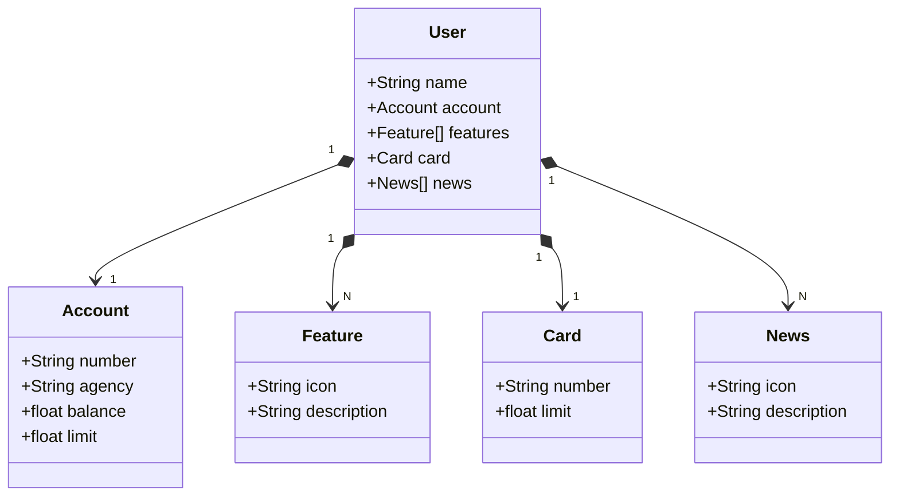

# Santander Dev Week - Spring Framework Project

This project was developed during the **Santander Dev Week** event, showcasing the use of the **Spring Framework** to build a backend application for managing users, accounts, cards, features, and news.

## Features

- **User Management**: Create and retrieve user information, including associated accounts, cards, features, and news.
- **Account Management**: Manage account details such as number, agency, balance, and limits.
- **Card Management**: Handle card details, including unique card numbers and limits.
- **Feature and News Management**: Manage additional features and news items associated with users.

## Class Diagram



## Technologies Used

- **Java 17**
- **Spring Boot**
- **Spring Data JPA**
- **H2 Database** (for development)
- **Gradle** (build tool)

## Project Structure

- **Domain Models**:
  - `User`: Represents a user with associated account, card, features, and news.
  - `Account`: Represents a bank account with details like number, agency, balance, and limit.
  - `Card`: Represents a card with a unique number and limit.
  - `Feature` and `News`: Extend a base class `BaseItem` with common properties like `icon` and `description`.

- **Service Layer**:
  - `UserServiceImp`: Handles business logic for user management, including creating users and retrieving them by ID.

- **Persistence**:
  - `UserRepository`: Interface for database operations on users.

- **Configuration**:
  - `application-dev.yml`: Configuration for development using H2 database.

## How to Run

1. Clone the repository:
   ```bash
   git clone https://github.com/your-username/santander-dev-week-2023.git
   cd santander-dev-week-2023
   ```

2. Run the application in your favorite IDE and access http://localhost:8080/swagger-ui/index.html to manage requests.

3. Access the H2 console (development mode):
   - URL: `http://localhost:8080/h2-console`
   - JDBC URL: `jdbc:h2:mem:sdw2023`
   - Username: `sdw2025`
   - Password: (leave blank)

## Future Improvements

- Implement custom exceptions like `UserNotFoundException` and `UserAlreadyExistsException`.
- Add more unit and integration tests.
- Enhance error handling and validation.
- Implement unitary tests.
